# Proyecto Reto de Código N° 02

## Objetivos

 Identifica los elementos de navegación en los siguientes sites
    A continuación se ha echo la identificación de los distintos tipos de navegación encontrados en casa uno de los sitios dados, para un mejor entendimiento, se ha separado cada una con distntos colores.

### **1.  Breather**

****
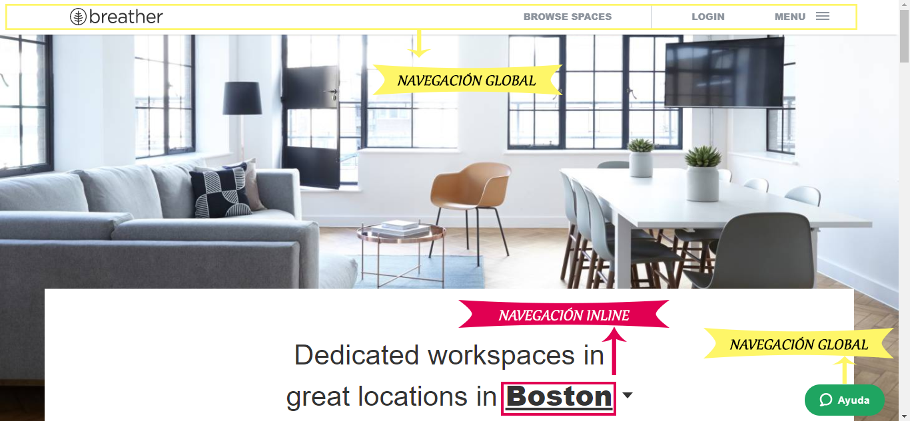
****
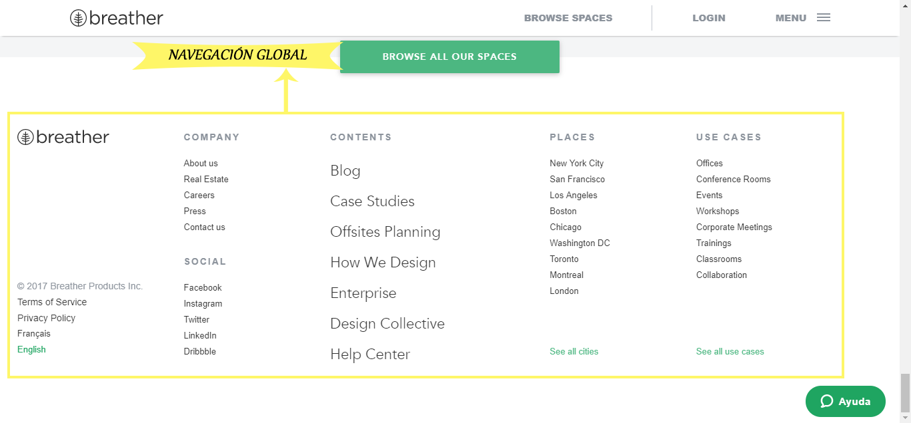
****
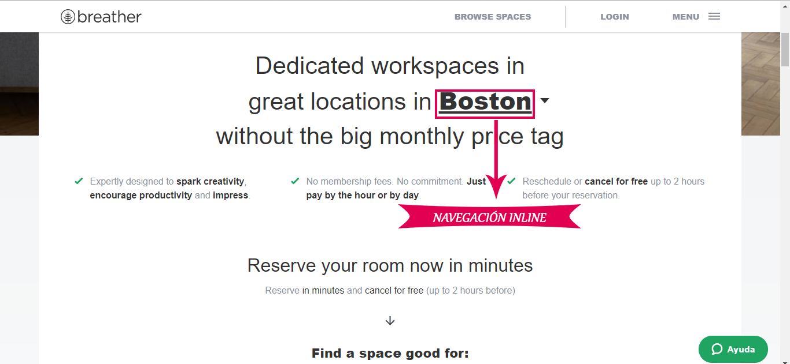
****
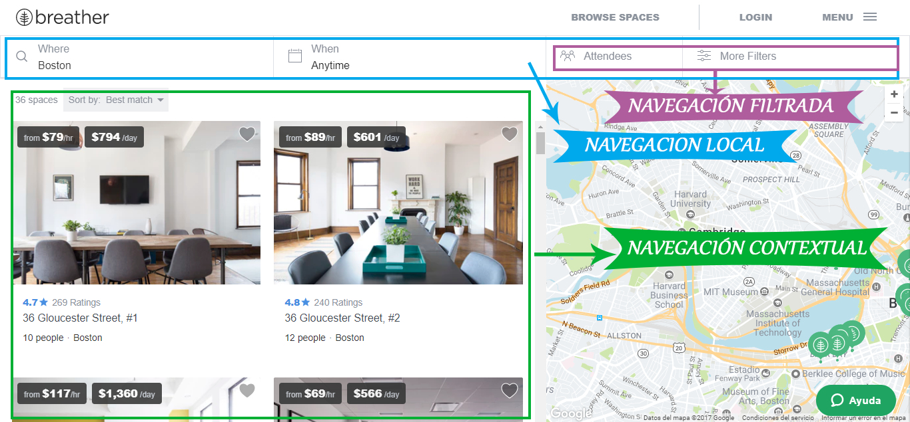
****
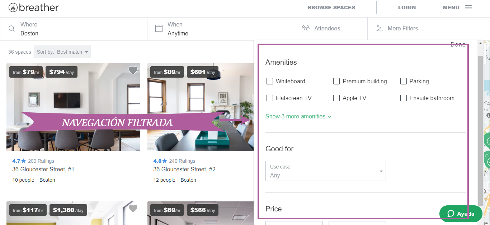
****
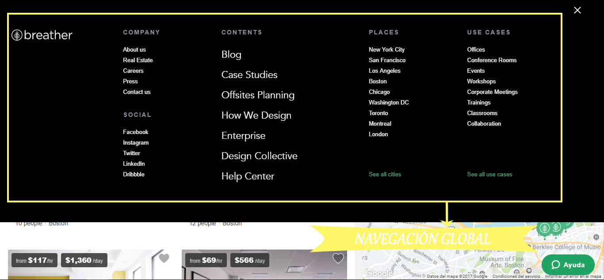
****

### **2.  Github**

****
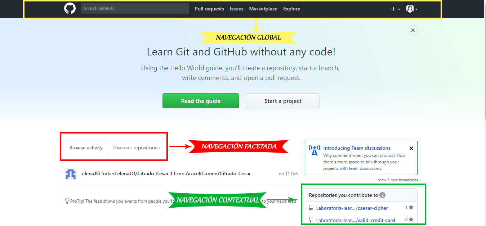
****
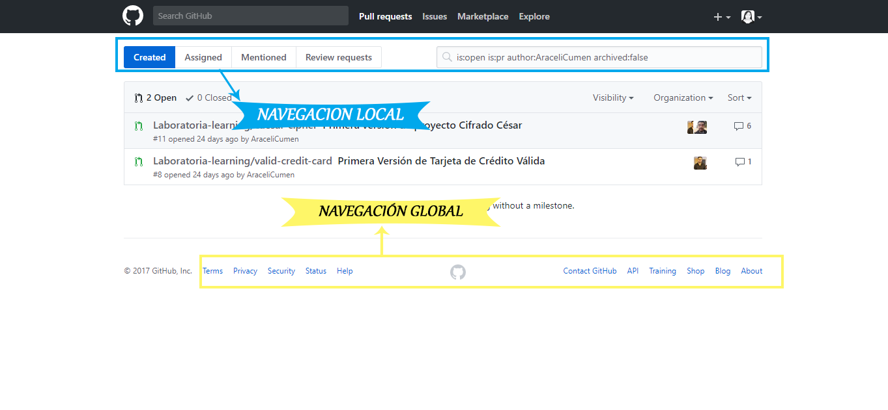
****
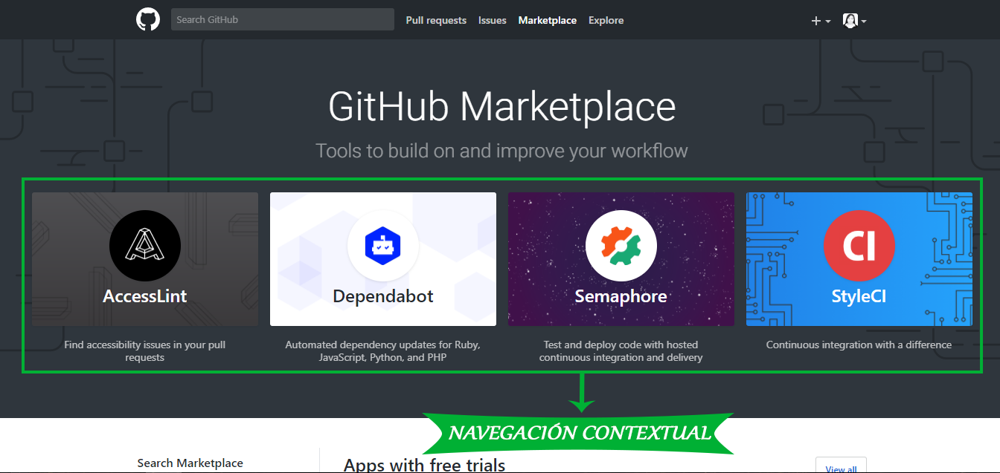
****
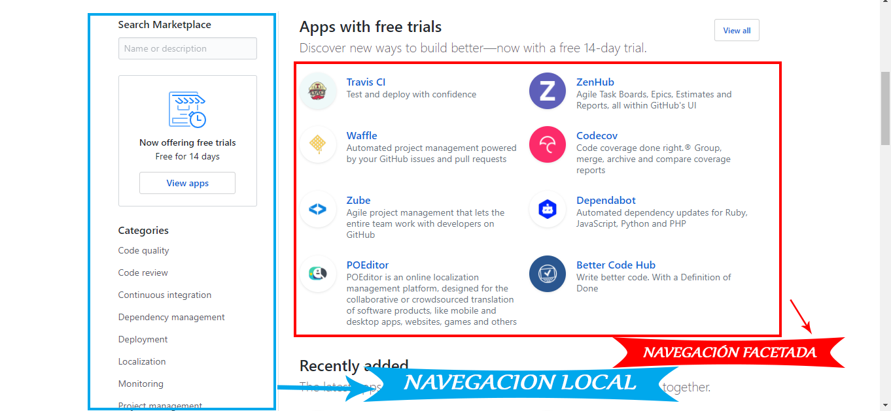
****
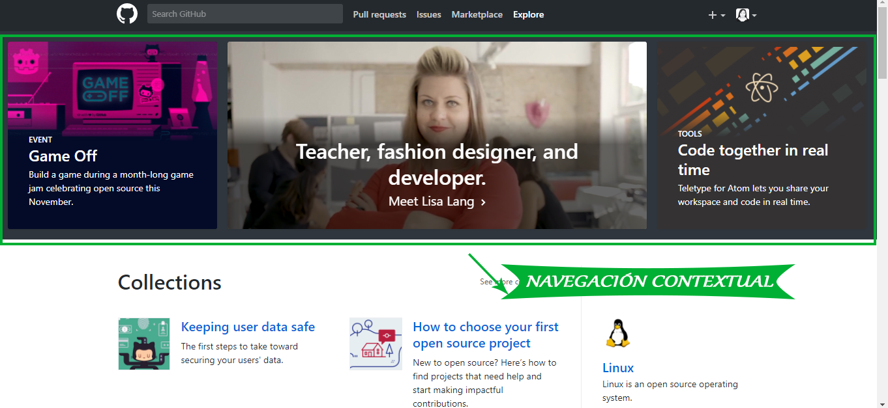
****
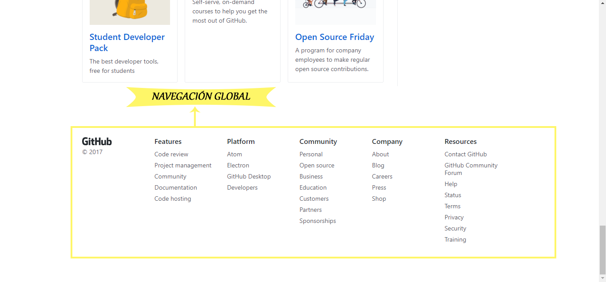
****
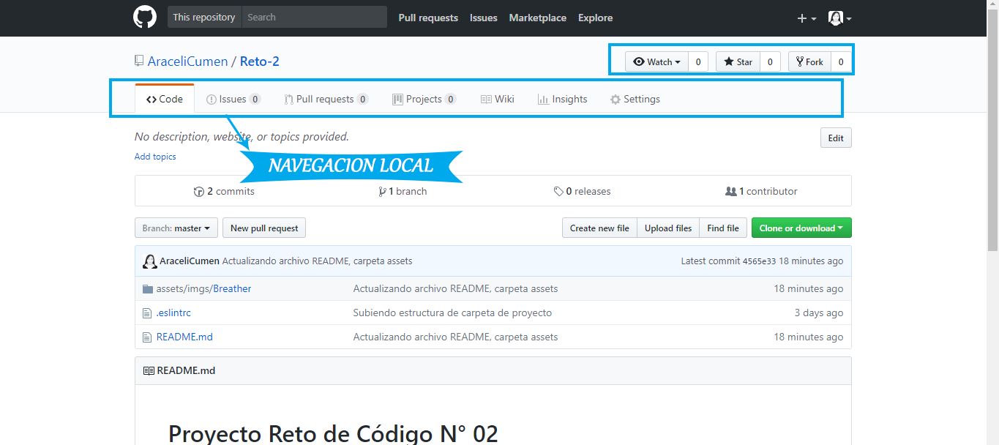
****

### **3.  Medium**

****
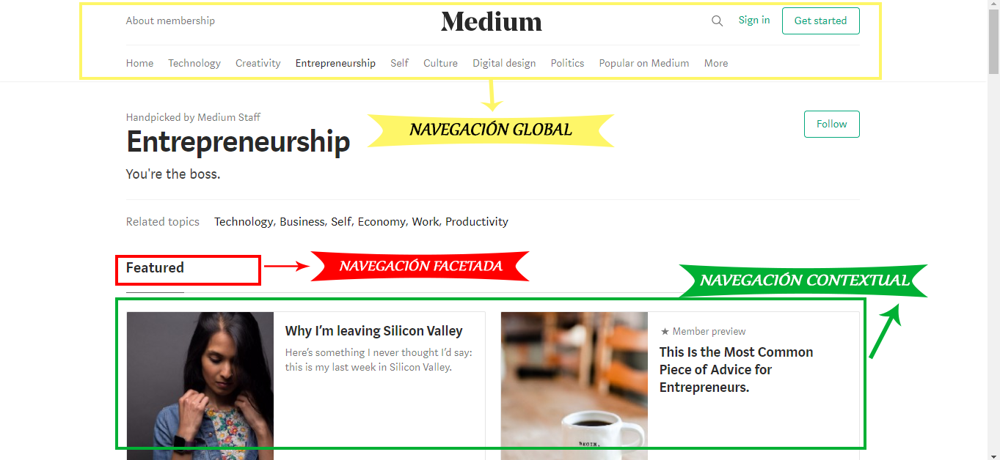
****
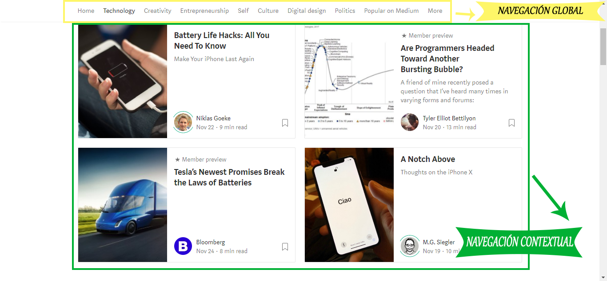
****
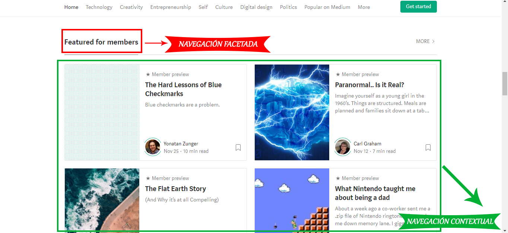
****
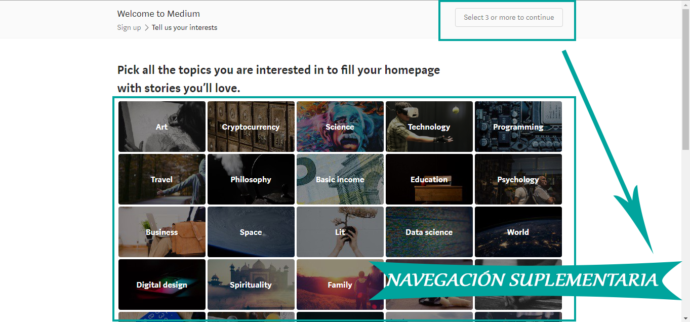
****
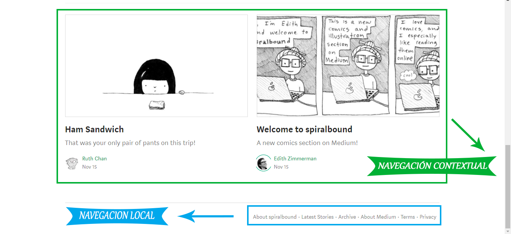
****
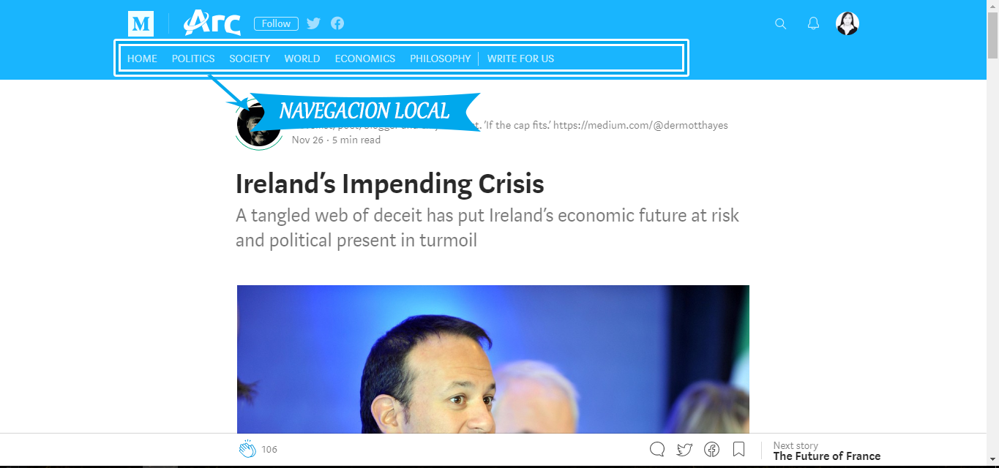
****
